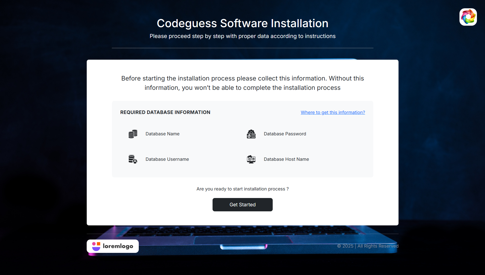
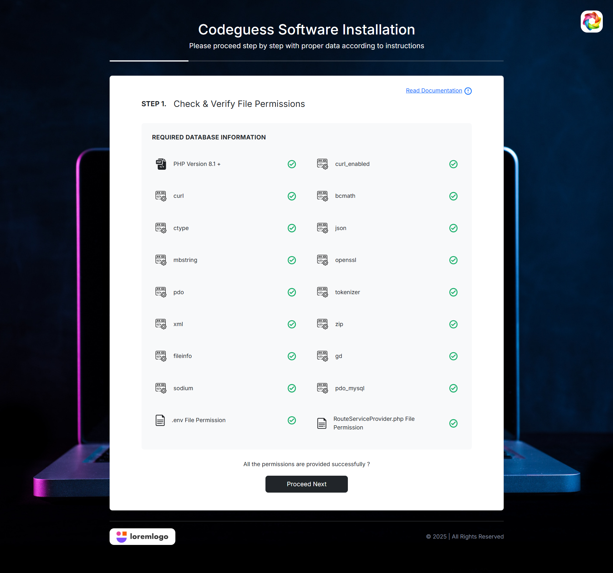
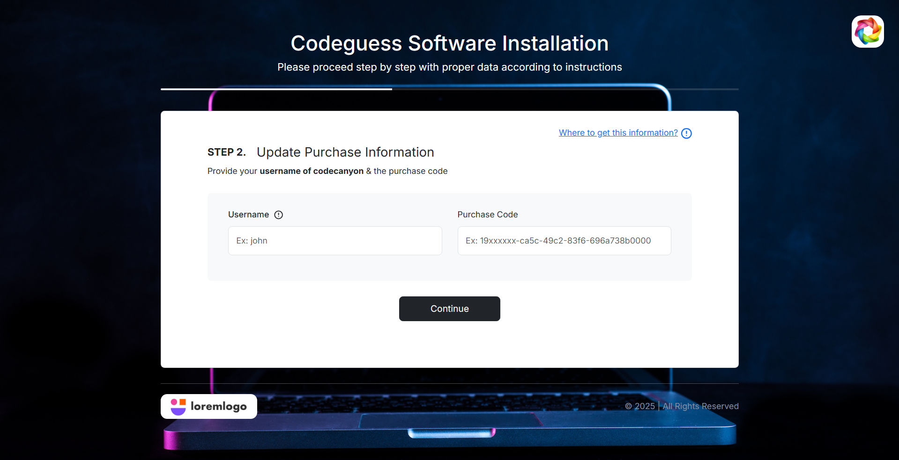
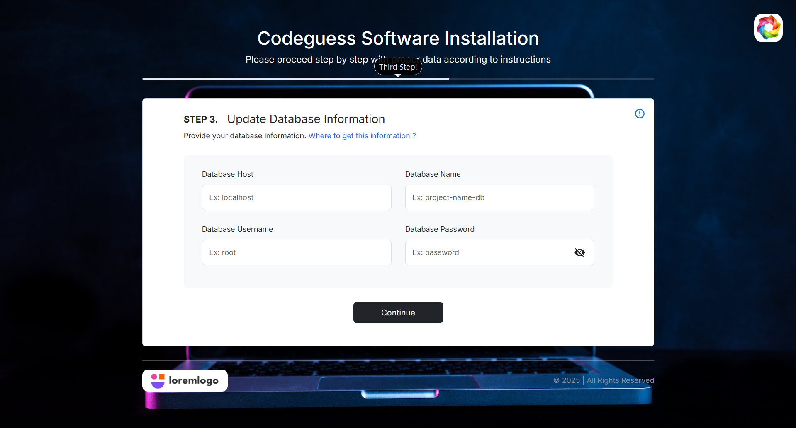
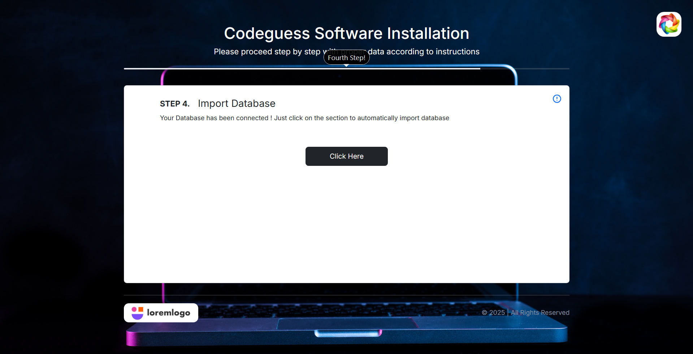
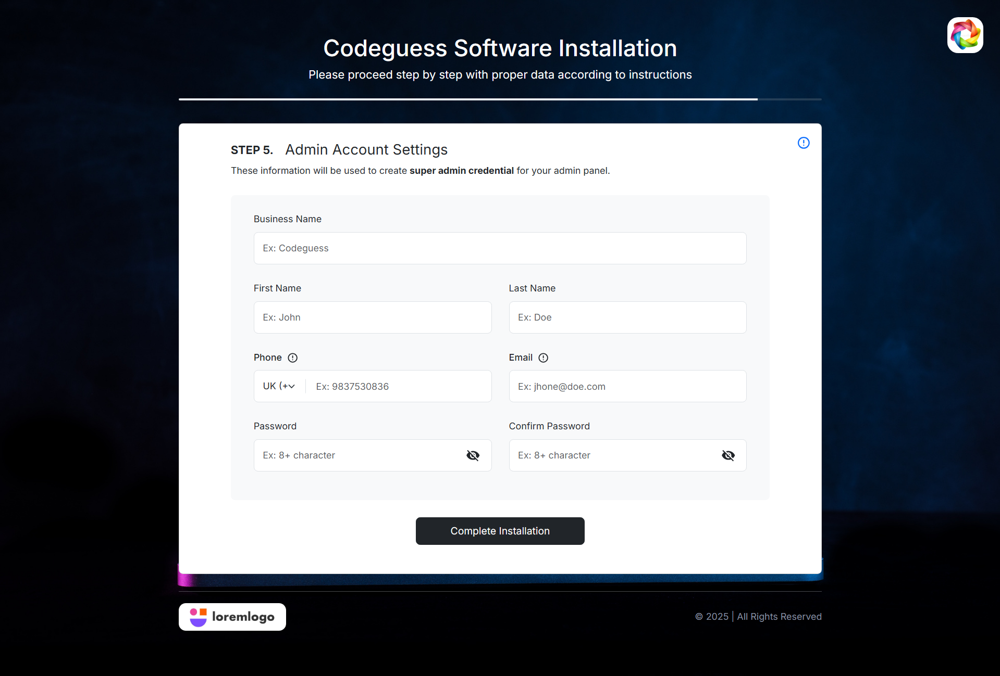
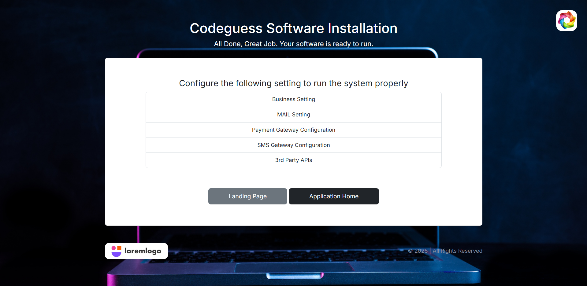
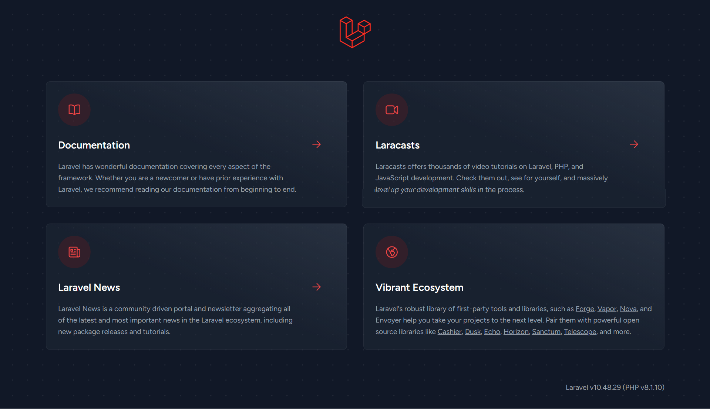

# About This Project

This project is a web-based software solution that requires installation and configuration before use.
The installation process is designed to be simple and guided step by step.

Please follow the steps below carefully and provide the required information to complete the installation successfully.

## 📦 Software Installation

Before starting, make sure you have:

- A working web server (Apache/Nginx)
- PHP 8+ installed
- MySQL database credentials (host, database name, username, password)
- Proper file permissions for storage and bootstrap/cache folders

## 🔑 Installation Steps
### ✅ Step 0: Required Database Information

Prepare the following database credentials:
- Database Host (e.g., 127.0.0.1)
- Database Name
- Database Username
- Database Password

These will be used to connect the application to your database.

### ✅ Step 1: Check & Verify File Permissions
Make sure PHP extensions like pdo_mysql, openssl, mbstring, and curl are enabled.

### ✅ Step 2: Update Purchase Information

Provide your purchase code and buyer username to verify your license.

### ✅ Step 3: Update Database Information

Fill in the database information you collected earlier:
- DB_HOST
- DB_DATABASE
- DB_USERNAME
- DB_PASSWORD

This will automatically update the .env file.

### ✅ Step 4: Import Database

The installer will import the default database schema and required tables.
Make sure your database is empty before proceeding.

### ✅ Step 5: Admin Account Settings

Set up your admin account credentials:
- Admin Name
- Admin Email
- Admin Password

This account will be used to log in to the system.

### ✅ Step 6: Final Configuration

Your software is now installed 🎉.

Before starting, configure:
- System settings (time zone, currency, etc.)
- Email settings (SMTP for sending mails)
- Other environment configurations if required.

### 🏠 Home – Start the Application

Once everything is set, you can log in to the system with your admin credentials and start using the software.

